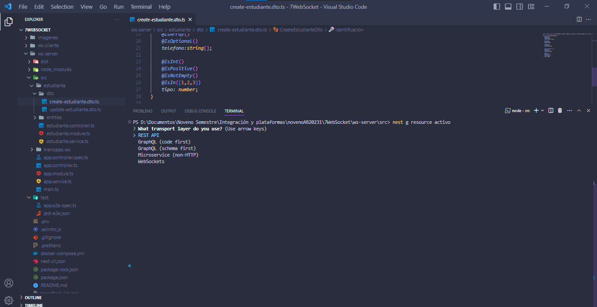
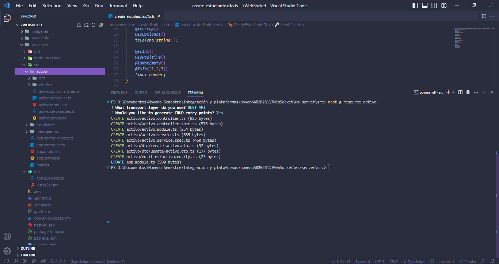
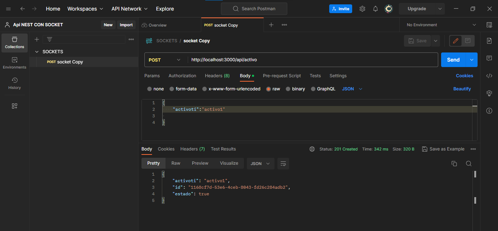
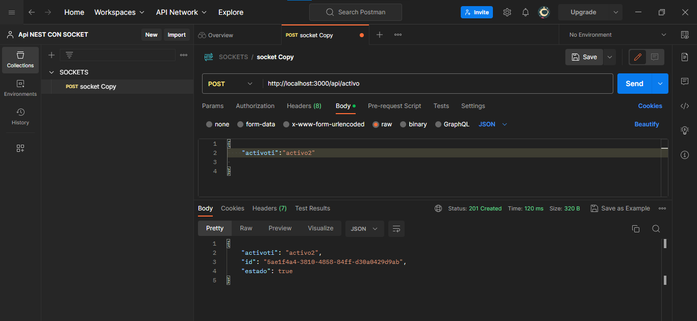
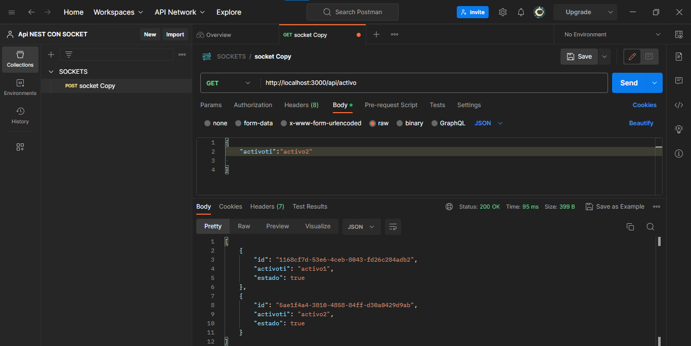
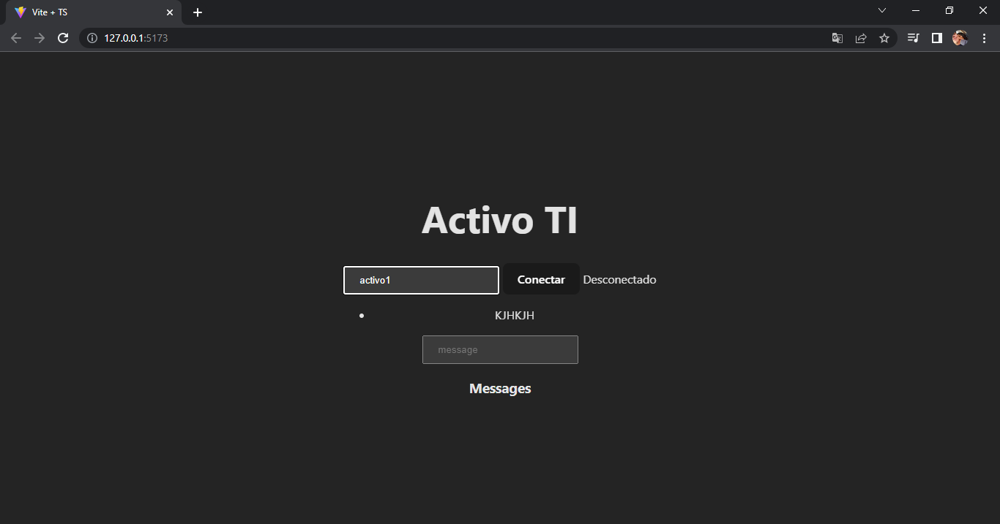
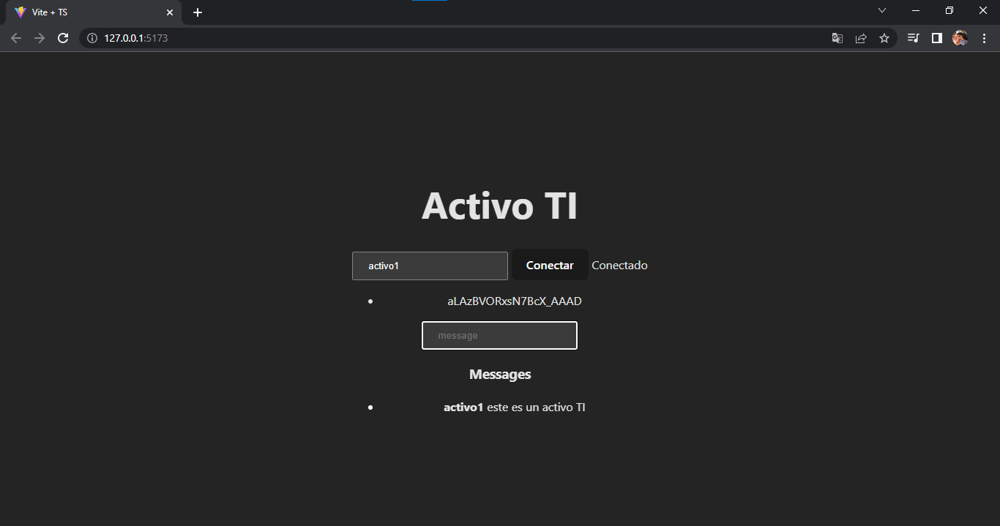
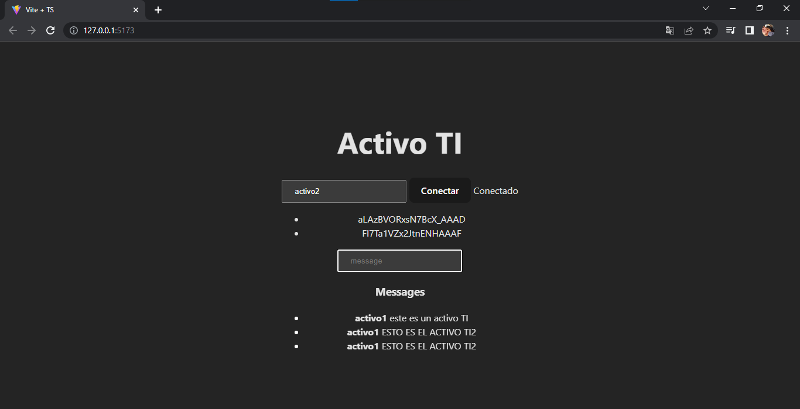
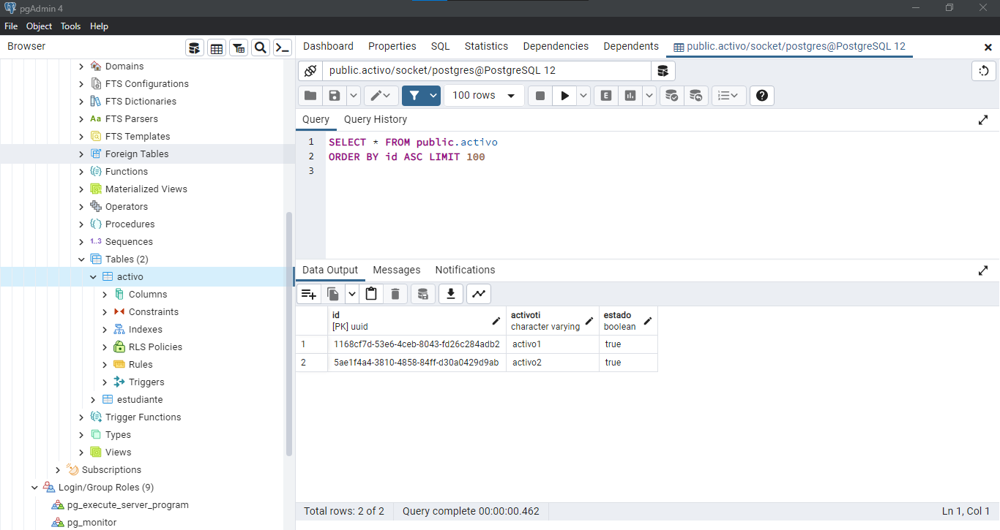
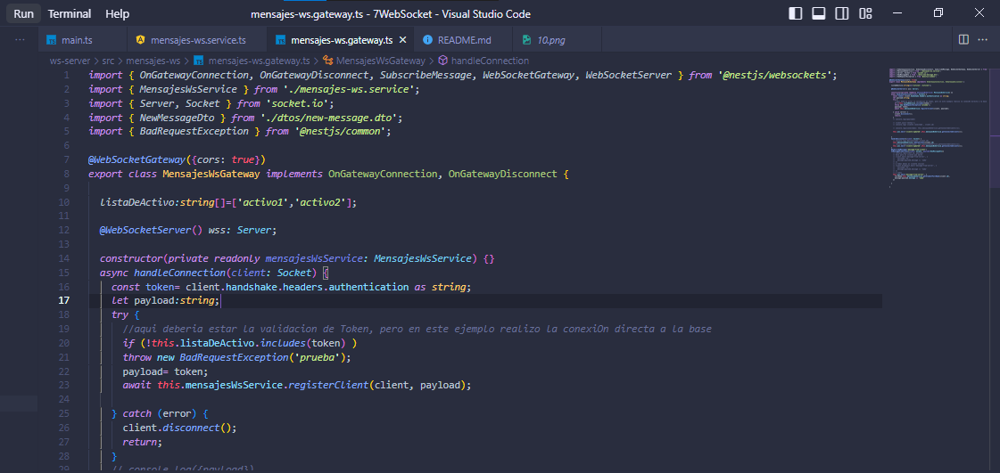

# PRÁCTICA DE SOCKET 


# Se creo el recurso de activo tecnológico 

```
nest g resource activo
```





# Se le agrego el crud de una rest api de activo



#  INSERTANDO ACTIVOS DESDE  POSTMAN 

## INSERTANDO ACTIVO TI 1



## INSERTANDO ACTIVO TI 2




## CONSULTANDO ACTIVOS (GET)



## DESDE FRONTEND 

## Escribimos activo agregado y ponemos conectar




## Verificacion de que esta conectado 


## Ahora agregamos mensajes desde activo1 y activo2







## Evidencia de los datos en postgre 



## Evidencia desde el array activos 




