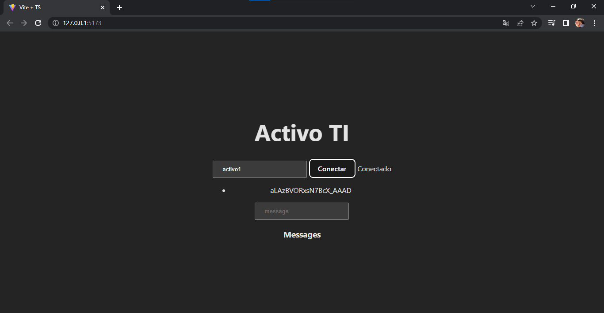

# PRÁCTICA DE SOCKET 


# Se creo el recurso de activo tecnológico 

```
nest g resource activo
```


# Se le agrego el crud de una rest api de activo


#  INSERTANDO ACTIVOS DESDE  POSTMAN 

## INSERTANDO ACTIVO TI 1


## INSERTANDO ACTIVO TI 2


## CONSULTANDO ACTIVOS (GET)


## DESDE FRONTEND 

## Escribimos activo agregado y ponemos conectar


## Verificacion de que esta conectado 




## Ahora agregamos mensajes desde activo1 y activo2


## Evidencia de los datos en postgre 


## Evidencia desde el array activos 


