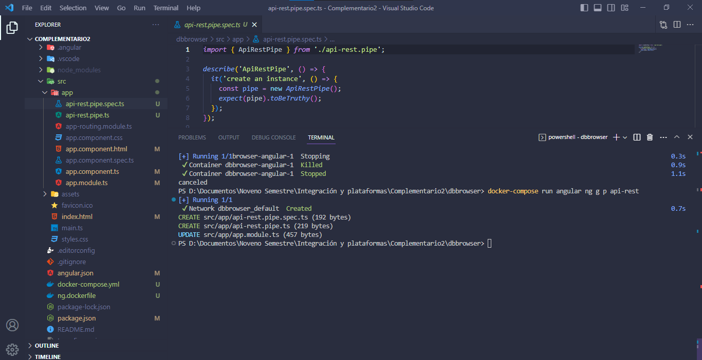
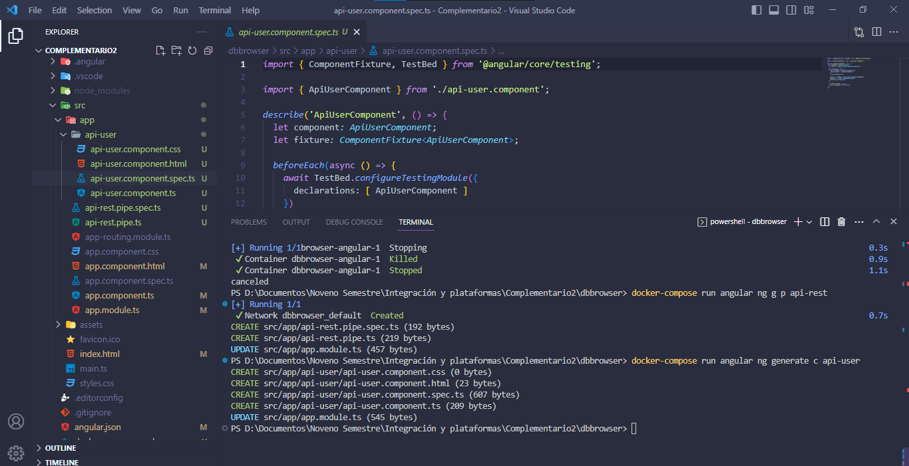
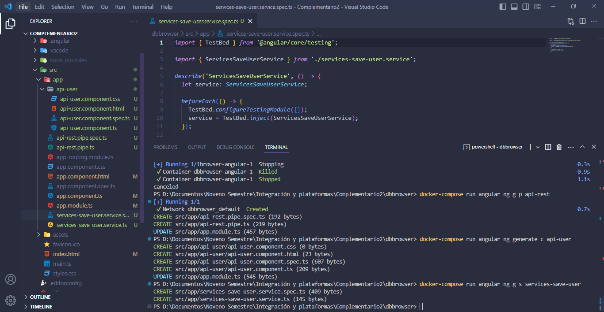
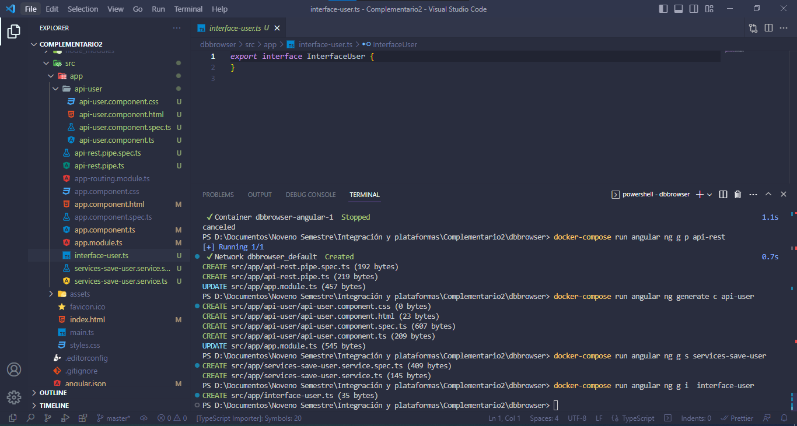
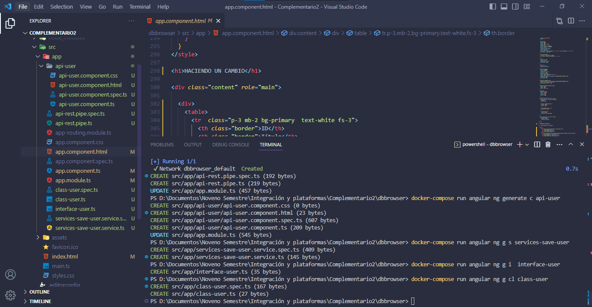
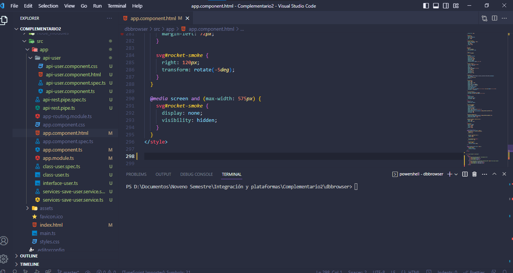
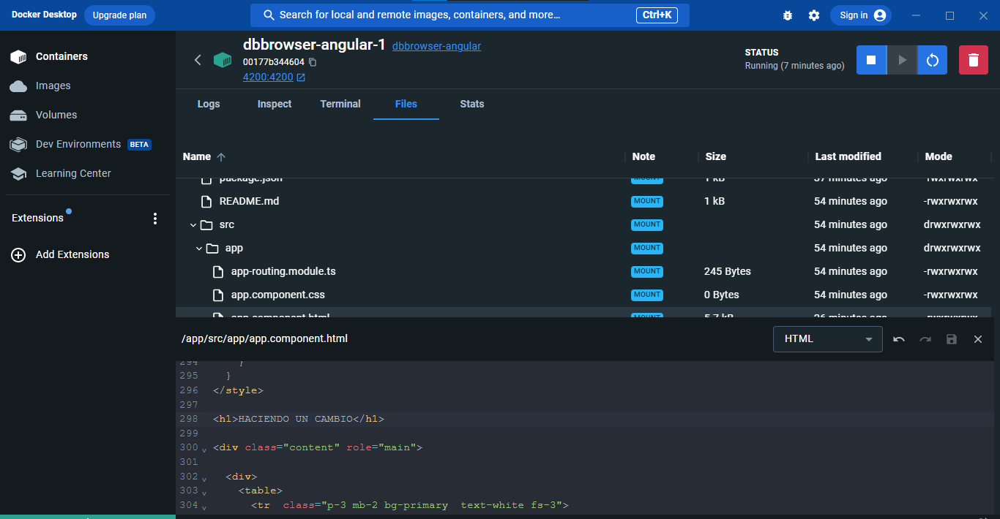
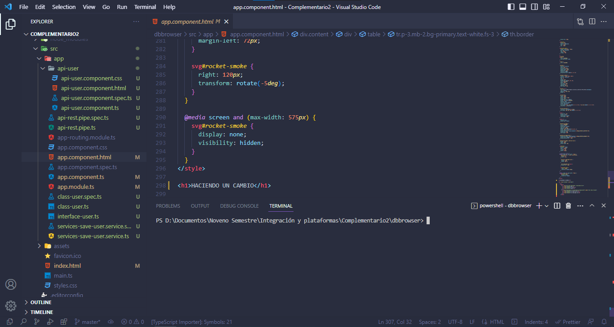
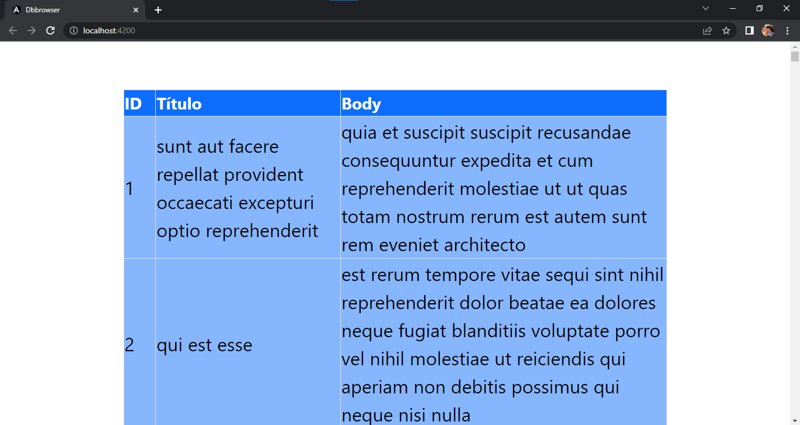

# PRÁCTICA 2


<br><br>
Evidencia de la práctica2  con docker  y un cli para fronted

Este proyecto fue hecho durante la carrera solicitando una peticion get mediante un framework

Cree la imagen con 

```
docker-compose run --build
```

Una vez creada la imagen podía acceder a las funcionalidades del CLI mediante


```
docker-compose run angular
```

Angular se definio el nombre del servicio en docker-compose para ejecutar por ng












## Bueno el otro punto pedía hacer cambios por un bind en volumen, esto es decir que desde el cambios de local podía hacerse cambios en el contenedor en tiempo real

## Agregue una línea 







## Frontend en ejecucion




