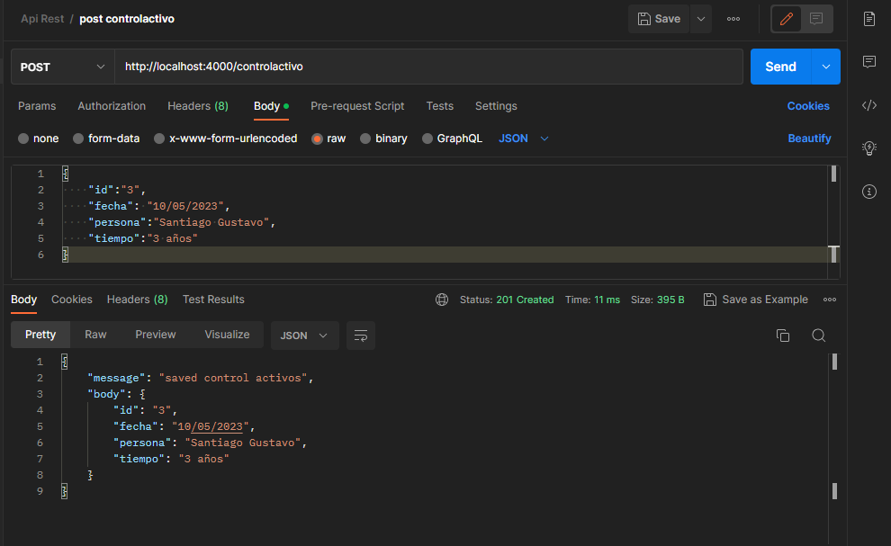
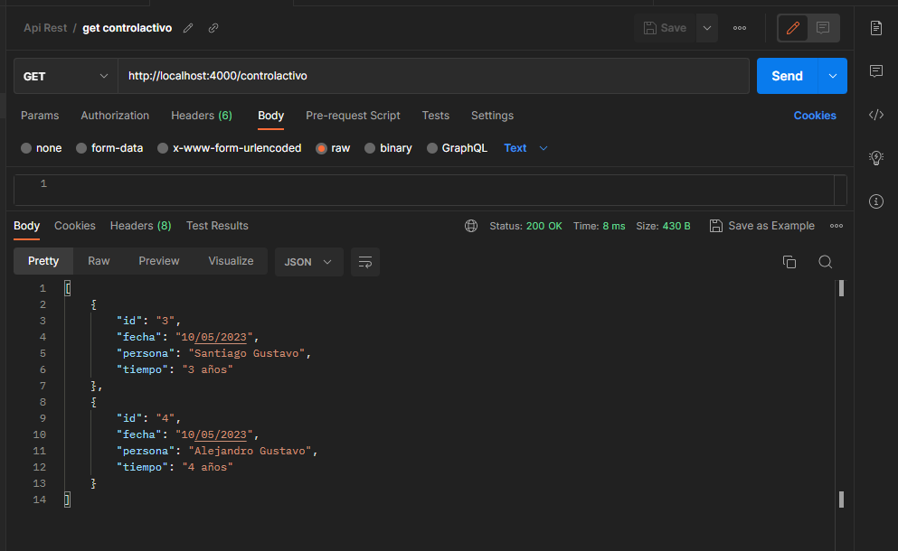
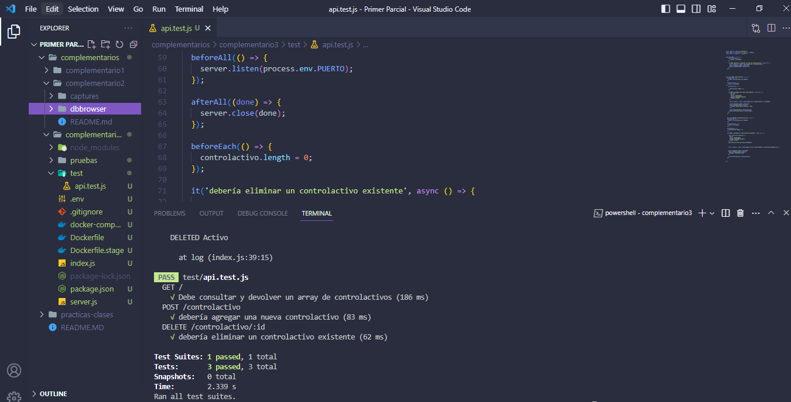
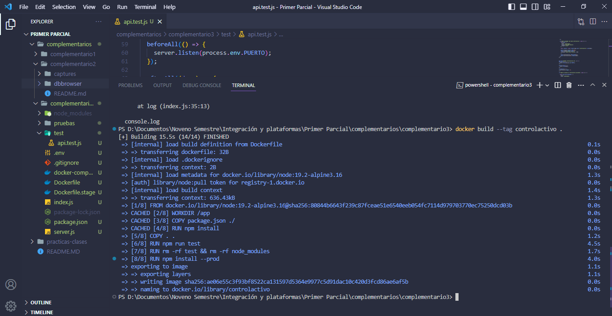
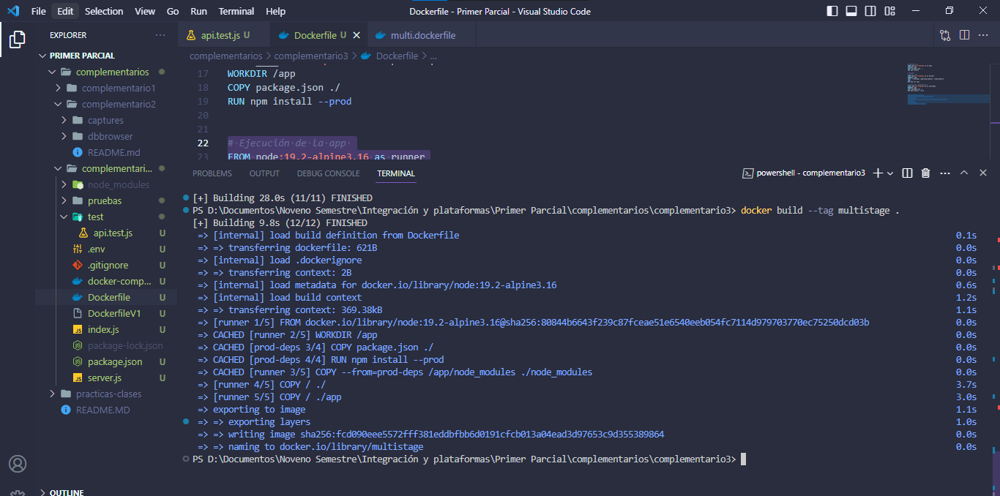
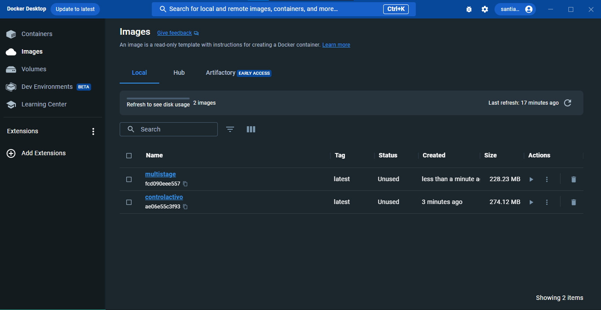
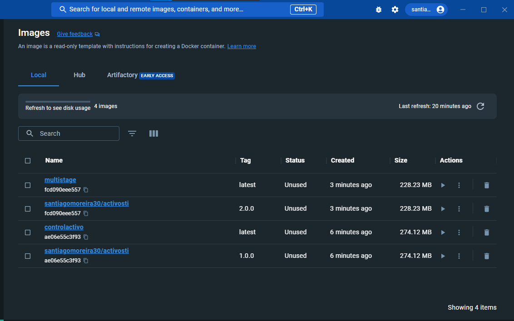
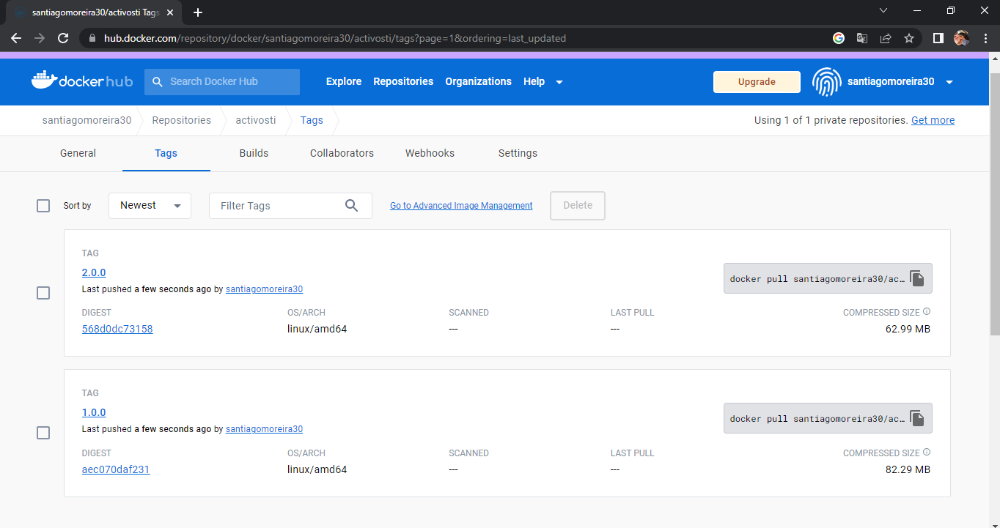
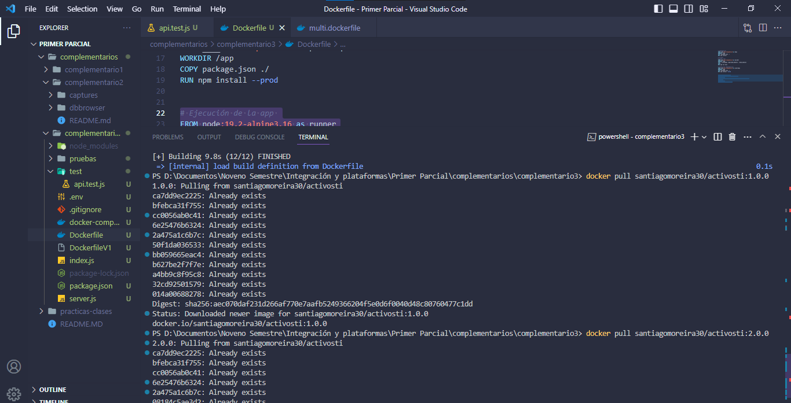
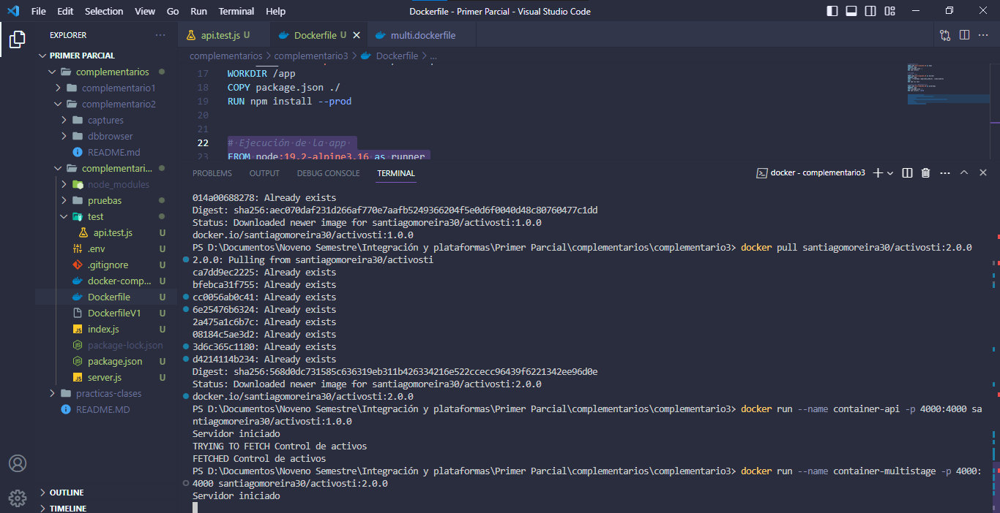

# PRÁCTICA 3

<br><br>
Evidencia de la práctica3 con docker hub y multistage


## Probando Api Rest sobre activos tecnológicos






## Probando test sobre la api rest mediante librería super test




## Creando los tag de los docker












##  Subir a la nube 



## Ejecucion de los tags de la nube en máquinas local 


Se uso estos comandos para poder descargar la imagen en local

```
docker pull santiagomoreira30/activosti:1.0.0
```

```
docker pull santiagomoreira30/activosti:1.0.0
```







